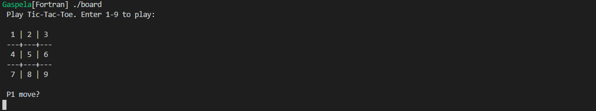
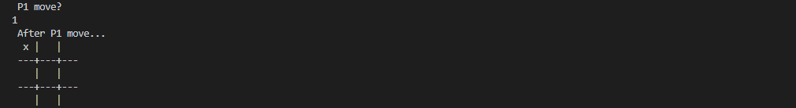
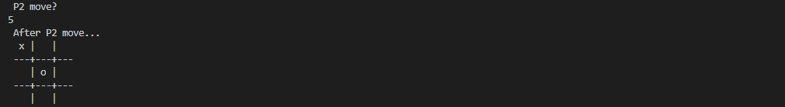

```bash
apt-get update; 
apt-get upgrade -y; 
apt install -y gfortran
gfortran -o board main.f95
```

```bash
*Initialize file*
./board
```


```bash
*Player move*
 P1 move? 
1
```


```bash
*Player move*
 P2 move? 
5
```


## Run Fortran
