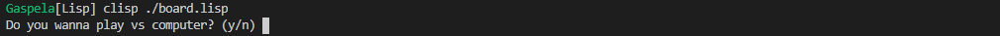
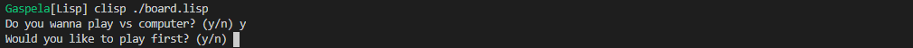
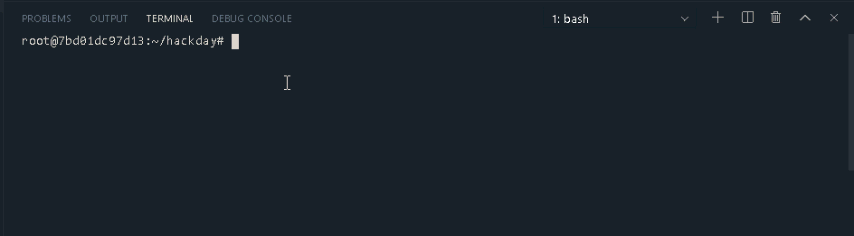

```bash
apt-get update; apt-get upgrade -y; 
apt-get install clisp -y
clisp board.lisp
```

```bash
*Select play computer or not.*
clisp board.lisp
```


```bash
*Select to be first player or not*
clisp board.lisp
Would you like to play first? (y/n)
```


## Run lisp
