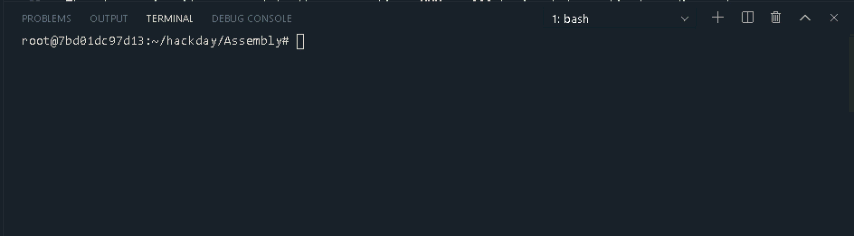
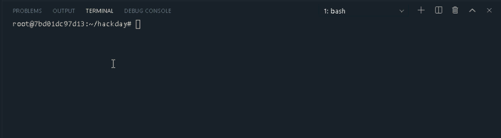
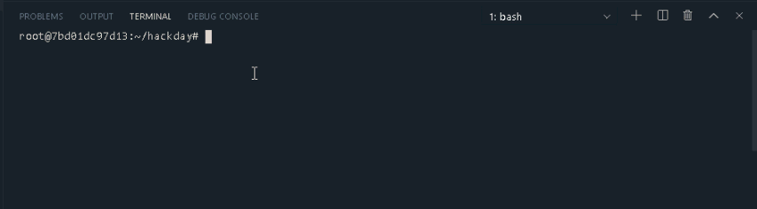

# TIC TAC TOE Hack Day  🎉

## LANGUAGES ⌨

* [Fortran](Fortran)
* [Lisp](Lisp)
* [Assembly](Assembly)

## Environment 💻
This project is interpreted/tested on Ubuntu 18.04

## HOW TO RUN ⚙

```bash
https://github.com/FeliPrado31/TicTacToe-HackDay.git
cd TicTacToe-HackDay
```

You can see how to run the code in the readme of each folder

## ALGORITHM 📂

A board with 9 positions and the first player will mark a "X" and the second player marks and "O". The players don't play an occupied position. 

The player wins if you complete the consecutives XXX or OOO horizontal, vertical or diagonal.

## USER FLOW 📊 

The user must type the number of the board in the following positions :

1 2 3

4 5 6

7 8 9

The system displays a board and starts with the first player selecting a position inside the board. The player must mark empty positions.

The player must type the number and press enter


## SCREENSHOT 📜

### Assembly

### Fortran

### Lisp
